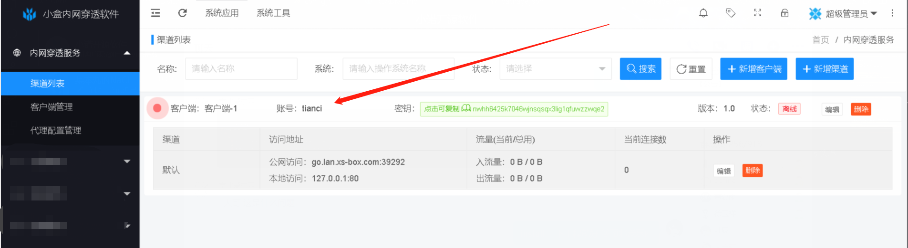
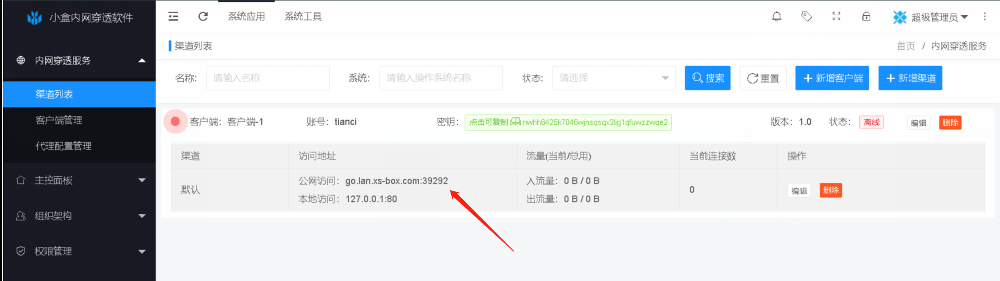
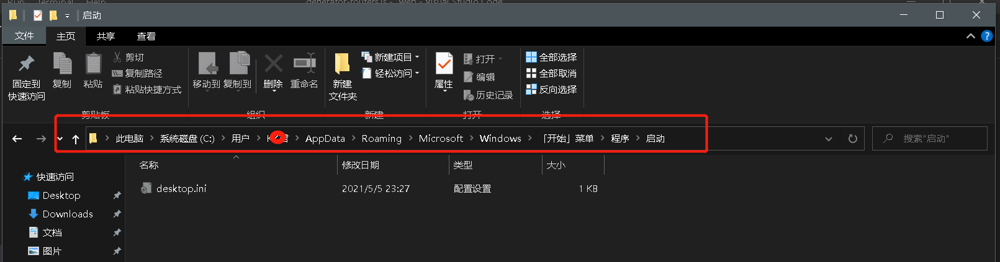

# 小盒软件

## 软件上线，欢迎体验

<a data-fancybox title="logo" href="xs-box.png"></a>

小盒内网穿透软件上线，欢迎体验

<font size="5">后台登录：<a target="_blank" href="http://www.xs-box.com/lan-server">http://www.xs-box.com/lan-server</a> 交流QQ群 860016134</font>

## xs-box-client 客户端

- 内网 · 穿透 · 让你在家也能管理公司服务器 · 实现远程办公梦想
- xs-box-client 是一个将局域网个人电脑、服务器代理到公网的内网穿透工具，支持tcp流量转发，可支持任何tcp上层协议（访问内网网站、本地支付接口调试、ssh访问、远程桌面...）
- 可以让外网直接访问本地网站 （Tomcat / web / nginx）等服务
- 可以让外网直接访问本地数据库 （mysql / oracle / SQLserver）等数据库
- 可以让外网直接访问内网linux,aix等服务器
- 可以远程桌面控制家里的电脑
- 可以搭建我的世界服游戏-外网联网

### 相关地址

- 客户端管理登录 <a target="_blank" href="http://www.xs-box.com/lan-server">http://www.xs-box.com/lan-server</a> 登录账号请使用第三方快速登录
- xs-box-client 客户端下载地
- 链接: <a target="_blank" href="https://pan.baidu.com/s/1Vdw36qJ2mIeocYVxwkwPZw">https://pan.baidu.com/s/1Vdw36qJ2mIeocYVxwkwPZw</a> 提取码: <font color="red">ivx5</font>

### 使用

#### 客户端配置
客户端管理登录 <a target="_blank" href="http://www.xs-box.com/lan-server">http://www.xs-box.com/lan-server</a>  登录账号请使用第三方快速登录，获取注册账号
<a data-fancybox title="账号" href="123.png"></a>


xs-box-client 的配置文件放置在conf目录中，配置 config.properties

```properties
lan.client.account=你的注册账号
#与client.key创建客户端时的秘钥保持一致；
client.key=xxxxxxxxxxxx （密钥自动获取，不需要管）
#ssl.enable=true时这里填写ssl端口，ssl.enable=false时这里填写普通端口
ssl.enable=true
ssl.jksPath=test.jks
ssl.keyStorePassword=123456
```

- 安装 <font color="red">JAVA JDK 1.8 </font> 或以上环境
- 下载客户端包 <font color="red">xs-box-client.zip</font> 到本地
- 解压后，启动即可
-   window 启动运行 <font color="red">startup.bat</font> 文件
-   linux  启动运行 <font color="red">startup.sh -start</font> 文件（注意要文件赋权限）[其他操作命令执行 startup.sh -h]
- 如果是其他系统环境，请联系群主获取最新客户端包
- 启动后，默认映射本地 <font color="red">127.0.0.1:8080</font> 地址和端口 ，请本地启动


#### 非 java 环境

- 如果你使用的是非java环境。需要在平台创建<font color="red">客户端</font>和<font color="red">代理映射配置</font>

```properties
# mac 64位  CLIENT_KEY 你的密钥 ，请登录平台获取
nohup ./xs-box_mac_os_amd64 -s www.xs-box.com -p 5200 -k CLIENT_KEY &

# linux 64位  CLIENT_KEY 你的密钥 ，请登录平台获取
nohup ./xs-box_linux_amd64 -s www.xs-box.com -p 5200 -k CLIENT_KEY &

# windows 64 位  CLIENT_KEY 你的密钥 ，请登录平台获取
./xs-box_win_amd64.exe -s www.xs-box.com -p 5200 -k CLIENT_KEY
```


#### 外网访问

- 公网访问地址：进入平台查看

<a data-fancybox title="端口获取" href="4567.png"></a>

- 然后浏览器输入  http://xxx.lan.xs-box.com:xxx 即可访问

## 使用教程

### xs-box 登录(本地)内网的 tomcat 服务

- 登录小盒平台 -> 新增代理配置 -> 本地地址/端口 输入  tomcat地址:端口 如： 127.0.0.1:8080
- win系统安装 xs-box-client 配置请看[客户端配置] 启动客户端
- 浏览器输入 http:/xxx.lan.xs-box.com:30002(具体看对应的公网端口)  即可访问

### xs-box 登录(本地)内网的 nginx 服务

- 本地安装了一个Nginx，默认安装的Nginx端口是80。
- 登录小盒平台 -> 新增代理配置 -> 本地地址/端口 输入  Nginx地址:端口 如： 127.0.0.1:80
- win系统安装 xs-box-client 配置请看 [ 客户端配置 ] 启动客户端
- 浏览器输入 http://xxx.lan.xs-box.com:8080 即可访问

### xs-box 登录(本地)内网的 Linux 系统

- 登录小盒平台 -> 新增代理配置 -> 本地地址/端口 输入  linux地址:端口 如： 192.168.1.1:22
- Linux系统安装 xs-box-client 配置请看 [ 客户端配置 ]
- 在ssh客户端上输入  主机名：xs-box.com 端口号： 30002(具体看对应的公网端口)
- Linux系统SSH远程登录 通过命令ssh root@xxx.lan.xs-box.com -p 30002(具体看对应的公网端口)

### 后台启动 xs-box-client
- 把 start java -jar xs-box-client-1.6.0.jar 修改为 start <font color="red">javaw</font> -jar  xs-box-client-1.6.0.jar


### 开机启动 xs-box-client
- 注意下面的 <font color="red">xxxx</font> 。是指系统账号，如果你是管理员登录 用 administrator 替换
- Window 系统 复制startup.bat到 C:\Users\\<font color="red">xxxx</font>\AppData\Roaming\Microsoft\Windows\Start Menu\Programs\Startup
- <a data-fancybox title="开机启动" href="startwin.png"></a>
- 修改里面的内容。把 start java -jar xs-box-client-1.6.0.jar 修改为 start <font color="red">javaw</font> -jar <font color="red">D:\xs-box-client\xs-box-client-1.6.0.jar</font>     ->  [ jar路径根据自己的位置填写，保证正确 ]  保存即可。

### 问题咨询与帮助

使用xs-box过程中遇到问题可以先查看 xs-box-client 日志文件，日志路径：xs-box-client/logs，这样很容易排查出问题的具体原因。